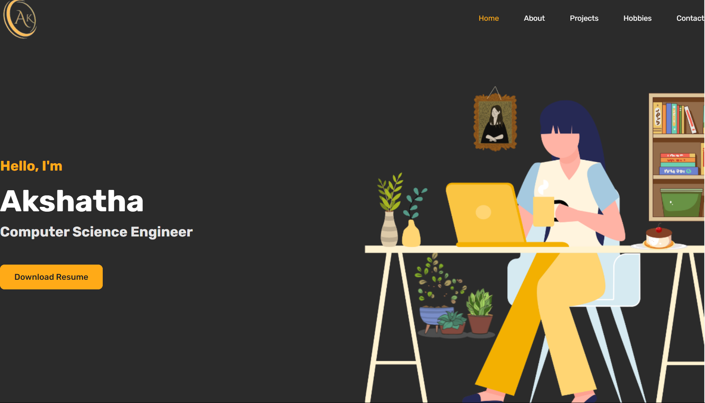
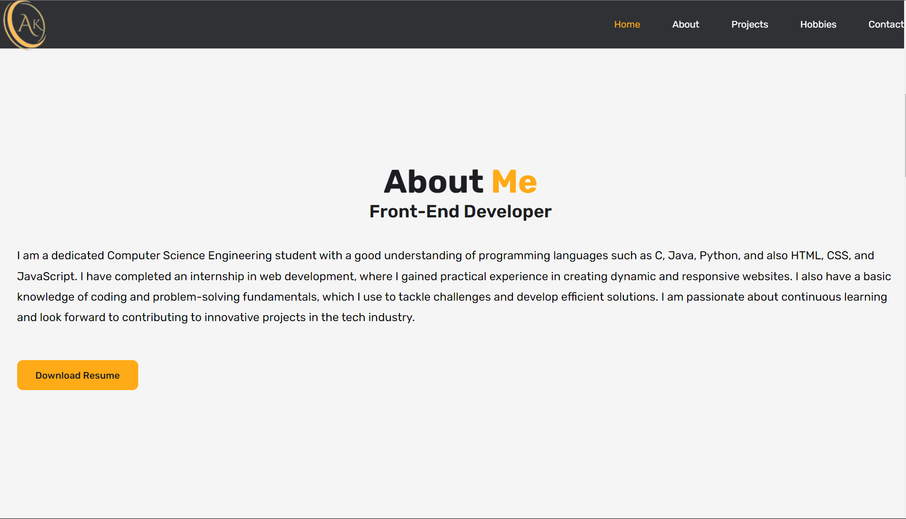
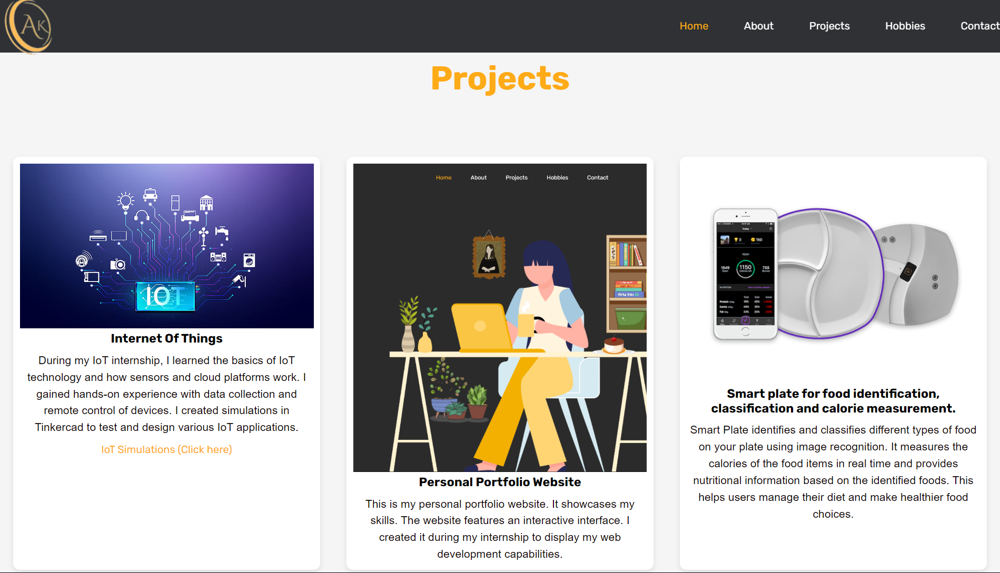
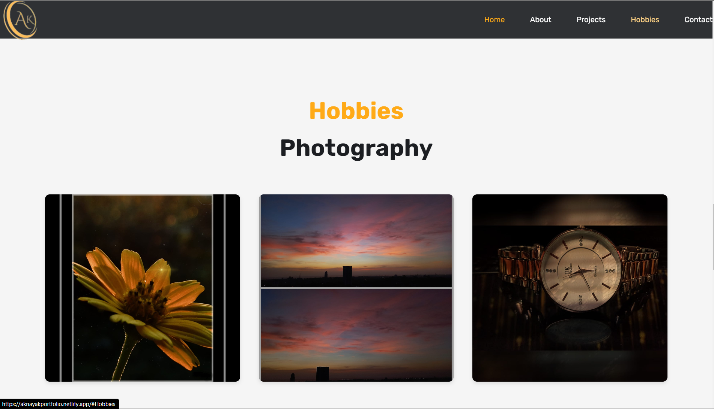
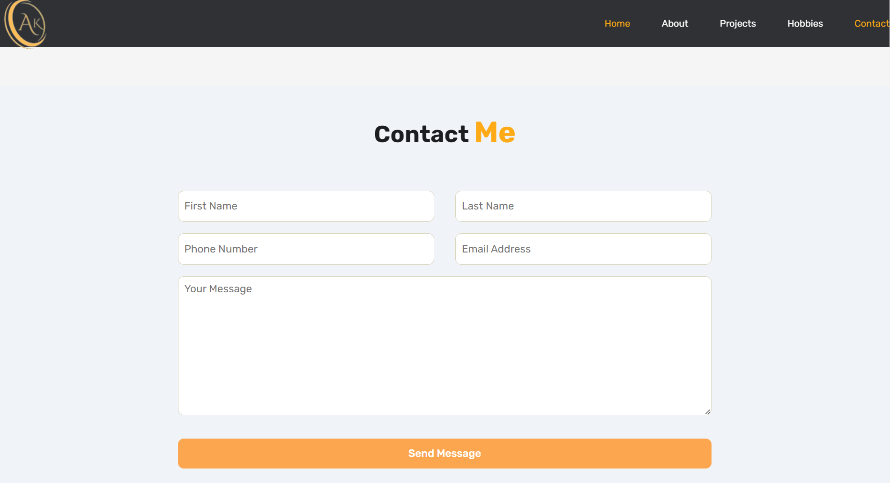

# Portfolio Website

Welcome to my portfolio website! Here, you can learn more about me, explore my projects, discover my hobbies.

## Table of Contents

- [Home]
- [About]
- [Projects]
- [Hobbies]
- [Contact]

## Home

The home page provides an introduction to who I am.

## About

In the About section, you’ll find detailed information aboutme, including my educational background and my objective. This section aims to give a deeper insight into my professional ethos and achievements.

## Projects

The Projects page showcases the various projects I’ve worked on. Each project includes a description, the technologies used, and links to the project repository. This section demonstrates my practical skills and the real-world applications of my work.

## Hobbies

The Hobbies section highlights my personal interests outside of coding.

## Contact

A simple contact form.

Feel free to explore the site.

